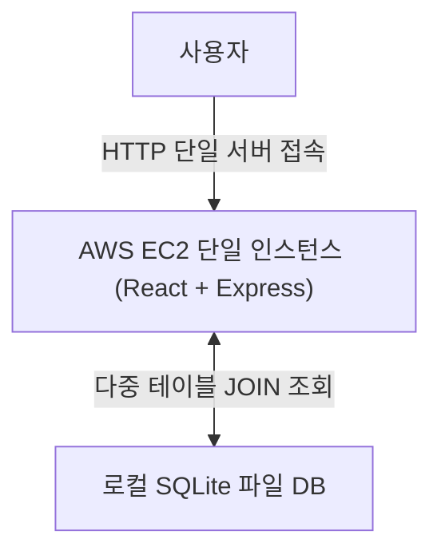
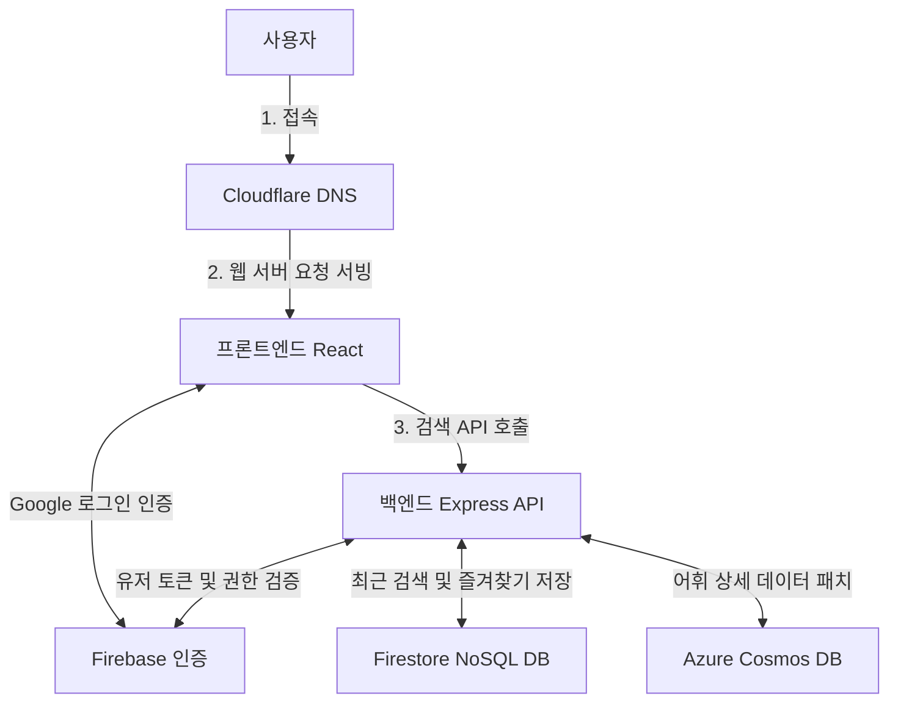
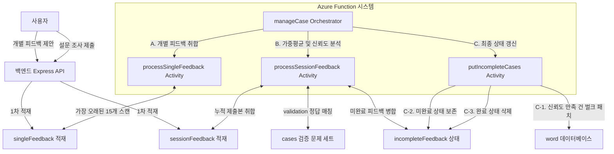
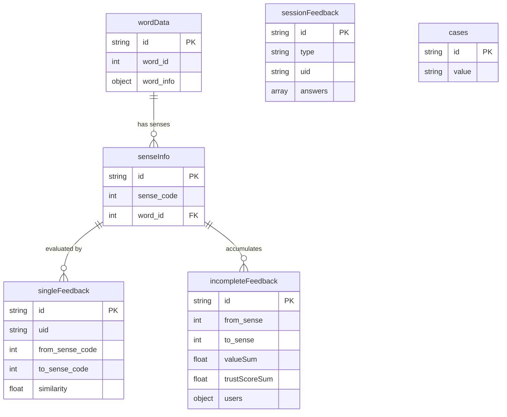

# 1. 개요
**유의어-반의어 사전은 텍스트 임베딩 모델과 사용자 참여형 피드백을 통해 단어 간의 유사성을 판단하고 폭넓은 연관 어휘를 제공하는 웹 기반 온라인 사전 서비스입니다.**
- **기간**: 
  - 2024.09. ~ 2024.12. (13주, 1차)
  - 2025.03. ~ 2025.06. (13주, 2차)
- **인원**: 4인
- **담당 역할**: 시스템 구조 설계, 데이터 엔지니어링, DB 설계/관리, 클라우드 인프라 구축/관리
- **개발 환경**:
    - 프론트엔드: React.js, D3.js, CSS
    - 백엔드: Node.js, Express.js
    - 데이터베이스: Azure Cosmos DB, Firebase Firestore Database
    - 외부 서비스 및 인프라: Microsoft Azure, Cloudflare DNS, Firebase Authentication, OpenAI API (text-embedding-3-large)

# 2. 배경
### 2-1. 기획 의도
- 기존의 사전 편찬 방식은 편찬자의 주관적 직관에 의존하여 유의어·반의어 관계를 수작업으로 기재하므로, 양방향 매칭이 누락되거나 극히 일부의 대표 단어만 등재되는 근본적인 누락 문제가 존재했습니다.
- AI 임베딩 모델을 통한 의미 유사도 분석과 사전 데이터를 결합하여 자동으로 의미 관계를 식별하는 알고리즘을 개발해, 편찬자의 한계와 주관성 및 누락 문제를 극복한 대규모 온라인 사전 어휘망 구축을 추진하였습니다.

1차 프로젝트(2024.09. ~ 2024.12.)에서 데이터 정제 알고리즘과 기초 서비스를 설계하고, 2차 프로젝트(2025.03. ~ 2025.06.)에서 시스템을 상용 서비스가 가능하도록 반응성과 안정성을 수정하고 크라우드소싱 로직을 추가해 장기적인 데이터 신뢰성을 높였습니다.

### 2-2. 목표
- 표준국어대사전 데이터와 어휘 임베딩(word embedding)을 결합해 어휘 유사도를 자동 산정하고, 크라우드소싱을 통해 유사도의 정확성을 지속해서 정제·성장시키는 무인 자율 어휘 데이터베이스 모델
- D3.js force-directed 인터랙션 그래프 및 하이퍼링크 단어 이동을 통해 사용자가 단어 관계망을 시각적으로 탐색, 공유할 수 있는 직관적인 지능형 사전 서비
- 무중단 자동 확장 및 DDoS 보안을 갖춘 상용 서비스 수준의 웹 인프라 배포

### 2-3. 프로젝트 발전 과정
| 구분 | 1차 프로젝트 | 2차 프로젝트 |
| :--- | :--- | :--- |
| **목표** | 임베딩 벡터 기반 대규모 어휘망 구축 검증 | 고가용성 분산 웹 서비스화 및 품질 자율 정제 |
| **인프라 구조** | 단일 AWS EC2 인스턴스 | Azure Container Apps (Multi-Container) |
| **데이터베이스** | SQLite (Local File Database) | Azure Cosmos DB (클라우드 기반 NoSQL) |
| **데이터 개선 메커니즘** | 없음 | Azure Function과 크라우드소싱에 기반한 자동 개선 |

# 3. 기능
### 3-1. 메인 검색 페이지
|||
|--|--|
|메인 페이지|검색 결과|
- 검색 결과 페이지에서 원하는 항목을 선택하여 상세 페이지로 이동할 수 있습니다.

#### 3-2. 어휘 상세 정보 및 관계도 시각화 페이지
|||
|--|--|
|상세 정보|그래프 시각화|
- 표제어의 발음, 원어(한자 등), 각 의미별 연관 단어 리스트를 표시하며, '관련성순', '비슷한 말 먼저', '반대말 먼저'의 정렬 필터 기능과 페이징 처리를 제공합니다.
- D3.js로 2차원 관계형 어휘망을 그래프로 시각화합니다. 유의어(노란색), 반의어(빨간색) 노드를 실시간 드래그로 조작하고 노드 클릭을 통해 다른 단어로 즉시 이동할 수 있습니다.
- 어휘 정보 피드백을 위해 복사(📋) 버튼을 눌러 어휘 ID를 클립보드에 복사할 수 있습니다.

#### 3-3. 마이페이지 및 사용자 데이터 동기화

- Firebase Auth 기반 Google 소셜 로그인을 제공하며, 사용자별 단어 즐겨찾기 및 최근 검색 목록을 추적하고 Firestore DB에 실시간 저장합니다.

#### 3-4. 어휘 개선 피드백 및 자동 업데이트 설문
|||
|--|--|
|어휘 정보 정정/제안 기능|정기 피드백 세션|

- 사용자가 어휘 상세 화면에서 복사한 개별 의미 코드를 정정 제안 팝업에 입력하여, 해당 단어 쌍의 유사도를 제출할 수 있는 팝업 피드백을 제공합니다.
- 정정 제안과 무작위 어휘 쌍을 통해 주기적으로 정기 피드백 세션을 생성하고, 유저의 신뢰도 수준에 맞춰 신뢰도 검증용 문항과 실제 문항의 비율을 동적으로 조정해 피드백을 수집합니다.

# 4. 구조
### 4-1. 1차 프로젝트 구조

### 4-2. 2차 프로젝트 구조

### 4-3. 임베딩 벡터와 사전 데이터를 통한 어휘 관계 자동 식별 알고리즘

임베딩 벡터(Embedding vector)는 단어 임베딩(Word mbedding)을 통해 산출한 다차원 벡터값으로, 유사한 맥락에서 사용되는 단어는 높은 코사인 유사도를 갖도록 설계되었습니다. 따라서 어휘의 벡터 간 코사인 유사도를 통해 단어가 어느 정도로 밀접한 관련이 있는지를 알 수 있습니다. 

<table border="1" align="center">
  <tbody>
    <tr>
      <td>표준국어대사전 데이터</td>
      <td>임베딩 입력</td>
    </tr>
    <tr>
      <td rowspan=2><pre>{
  표제어: 슬픔,
  품사 목록: [
    {
      품사: 명사,
      의미 목록: [
        {의미: 슬픈 마음이나 느낌.},
        {의미: 정신적 고통이 지속되는 일.}
      ]
    }
  ]
}</pre></td>
      <td>슬픔: 슬픈 마음이나 느낌.</td>
    </tr>
    <tr>
      <td>슬픔: 정신적 고통이 지속되는 일.</td>
    </tr>
  </tbody>
</table>

표준국어대사전 원본 데이터 구조와 임베딩 입력(예시)
 

OpenAI의 text-embedding-3-large API를 통해 국립국어원 표준국어대사전의 어휘 데이터를 바탕으로 어형과 의미를 짝지어 임베딩 벡터를 계산하고 각 어휘별로 1,024차원 벡터로 저장했습니다. 이렇게 구한 28만 개 어휘 데이터를 벡터 데이터베이스인 Chroma의 유사 벡터 검색 기능을 통해 어휘당 30개씩의 가장 유사한 어휘를 추출했습니다.

유사도 구간별 단어 쌍의 개수와 의미적 정확도
 
이렇게 추출한 유사 어휘 목록 중 50% 이상의 정확도를 가지며 전체 단어 쌍에서 44%를 차지하는 유사도 0.65 이상 구간을 선택하고 0.65 미만 구간은 데이터의 양이 과도하고 의미 관계를 정확히 반영하지 못한다고 판단하여 폐기하였습니다. 이를 통해 1,218,678개의 의미적 근연 관계가 있는 단어 쌍 데이터를 수집하였습니다.
 
<table border="1" align="center">
  <thead>
    <tr>
      <th style="padding: 10px; background-color: #f2f2f2;"></th>
      <th style="padding: 10px; background-color: #f2f2f2;">합리</th>
      <th style="padding: 10px; background-color: #f2f2f2;">불합리</th>
      <th style="padding: 10px; background-color: #f2f2f2;">정론 1(正論)</th>
      <th style="padding: 10px; background-color: #f2f2f2;">정론 2(政論)</th>
    </tr>
  </thead>
  <tbody>
    <tr>
      <td style="padding: 10px; font-weight: bold; background-color: #f9f9f9;">합리</td>
      <td>-</td>
      <td><b>0.69</b></td>
      <td>0.72</td>
      <td>0.44</td>
    </tr>
    <tr>
      <td style="padding: 10px; font-weight: bold; background-color: #f9f9f9;">불합리</td>
      <td><b>0.69</b></td>
      <td>-</td>
      <td>0.48</td>
      <td>0.37</td>
    </tr>
    <tr>
      <td style="padding: 10px; font-weight: bold; background-color: #f9f9f9;">정론 1(正論)</td>
      <td>0.72</td>
      <td>0.48</td>
      <td>-</td>
      <td><b>0.61</b></td>
    </tr>
    <tr>
      <td style="padding: 10px; font-weight: bold; background-color: #f9f9f9;">정론 2(政論)</td>
      <td>0.44</td>
      <td>0.37</td>
      <td><b>0.61</b></td>
      <td>-</td>
    </tr>
  </tbody>
</table>

임베딩 벡터의 코사인 유사도
 
그러나 임베딩 벡터의 코사인 유사도는 두 비교 대상이 같은 의미적 카테고리에 있는가를 대략적으로 알 수 있을 뿐 두 대상이 가지는 의미가 비슷함을 알 수 있는 것은 아닙니다. 합리와 불합리는 의미상 정반대지만 높은 유사도를 가지고 있어 두 어휘가 동의어인지 반의어인지 구분할 수 없고, 정론(正論)과 정론(政論)은 의미상 관련성이 낮지만 동형어로서 비교적 높은 유사도를 갖습니다.
 
이를 극복하기 위해 동형어에 대해 유사도를 10% 감산 보정하고, 원본 표준국어대사전의 검증된 유의어(+0.9 ~ +0.95) 및 반의어(-0.95) 정보를 코사인 유사도에 덮어씌워 극성을 생성했습니다.

 

어떤 두 어휘 사이의 관계를 무향 가중치 그래프라고 생각할 때, 출발지부터 목적지까지의 모든 경로상의 유사도를 곱해 두 단어의 유사성과 관계를 계산할 수 있습니다. 이를 최대 8단계까지 반복함으로써 원본 표준국어대사전 대비 29.2배 증가한 2,440,269개의 어휘 관계망을 자동 생성했습니다.

### 4-4. 크라우드소싱 피드백 및 업데이트 알고리즘
어휘 유사도 데이터는 임베딩 벡터에 기초하기 때문에 실제로 어휘간의 유사도를 항상 정확하게 평가한다고는 볼 수 없습니다. 따라서 사용자가 능동적으로 데이터 개선에 참여하는 크라우드소싱 기능을 개발했습니다. 개선 기능은 사용자가 직접 개선을 제안하고 싶은 어휘 쌍을 1개 골라 제출하는 방식(이하 '개별 피드백')과 시스템에 의해 선정된 어휘 쌍 10개를 평가하는 방식(이하 '설문 피드백')으로 나뉩니다. 이용자는 각 어휘 쌍에 대해 –0.95, -0.85, -0.75, -0.65, 0, 0.65, 0.75, 0.85, 0.95의 응답 중 하나를 골라 제출합니다. 

 

시스템은 약 3일(KST 기준 매달 `2 + 3n`일) 0시에 Azure Function을 통해 검증용 문항 30개, 피드백이 필요한 시험 문항 30개 풀을 자동 추출하고, 설문 진입 시 해당 이용자의 신뢰도별로 검증 대 시험 문항의 비율을 7:3에서 1:9로 조절해 사용자마다 총 10개의 무작위 문항을 제공합니다. 검증 데이터는 미리 정답 유사도가 결정되어 있는 데이터로 이용자의 신뢰도를 산정하는 데만 사용되며, 실제 데이터의 갱신은 시험 데이터를 통해 이루어집니다. 검증 데이터와 이용자 응답을 비교해 이용자가 얼마나 정답에 가까운 응답을 제시하는지를 평가하고 이를 이용자 신뢰도 산정에 반영합니다.
 
 
 약 3일 간의 피드백 기간이 종료될 때마다, 이용자들의 개별적인 유사도 평가는 (응답값 * 해당 이용자 신뢰도)로 계산되어 합산되며, (응답값 합 / 신뢰도 합)으로 가중평균으로 최종적인 유사도를 계산합니다. 평가가 단어 데이터베이스에 반영되기 위해서는 일정 신뢰도 합이 필요합니다. 따라서, 어떤 어휘 쌍에 대해 신뢰도가 높은 이용자들이 유사도를 평가했다면 적은 응답으로도 평가가 승인되며, 신뢰도가 낮은 이용자들이 참여한 경우에는 승인을 위해 더 많은 이용자의 응답이 필요합니다. 
평가 기간이 종료될 때 신뢰도 합 임계값을 달성하지 못한 응답은 미완료로 저장하며, 해당 어휘 쌍은 완료될 때까지 반복적으로 설문에 제시됩니다. 충분한 신뢰도 합을 달성한 응답은 완료로 처리하는데, 원본 데이터와 마찬가지로 절대값 0.65 미만의 값이 도출될 경우, 해당 어휘 쌍은 무관계한 것으로 판단하여 파기하거나, 이미 DB에 존재하는 경우 삭제합니다. 절대값 0.65 이상의 응답은 DB에 추가하거나 기존 값을 수정합니다.
 

이상의 과정을 통해 별도로 관리자가 직접 사용자를 평가하거나 데이터를 검수/승인하지 않아도 자동으로 이용자의 어휘 이해 능력과 성실도를 평가하고, 집계된 응답을 신뢰도에 따라 평가 및 조정하여 데이터베이스에 반영해 지속적으로 데이터 품질을 향상시킬 수 있습니다.

### 4-5. 데이터베이스 및 클라이언트 구현

- 어휘 데이터가 가변적이고 중첩된 비정형적인 구조를 가지므로 비정형 구조 저장 및 쿼리에 용이한 NoSQL 데이터베이스인 Azure Cosmos DB에 JSON 문서 구조로 디정규화하여 저장했습니다.

### 4-6. 클라우드 인프라 및 보안 최적화
- 프론트엔드와 백엔드를 독립적으로 격리된 도커 이미지로 빌드하고 CaaS(서비스형 컨테이너)인 Azure Container Apps 서버리스 환경에 배포하였습니다.
- 트래픽 부하에 따라 컨테이너 인스턴스를 최소 0개에서 최대 10개까지 실시간 증감하는 오토스케일링 정책을 구축하여 저부하에서 저렴하고 고부하에서 빠르게 확장할 수 있도록 했습니다.
- DNS 레이어에 Cloudflare 프록시를 연결하여 포트 스캐닝 또는 DDoS 대량 트래픽 공격 가능성을 경감시키고 서비스의 가용성 신뢰도를 향상시켰습니다.

# 5. 문제와 해결
### 5-1. SQLite I/O 동시 읽기 병목으로 인한 쿼리 지연 문제
- 1차 프로젝트에서는 24만 표제어와 244만 관계 데이터가 수록된 대용량 사전 데이터를 로컬 SQLite 파일 기반으로 조회하여 단어 상세 페이지 진입 마다 발생하는 테이블 다중 조인 및 동시 디스크 읽기 입출력 병목으로 인해 검색 1회당 평균 4초의 레이턴시가 소요되어 정상적인 사전 조회가 불가능했습니다.
- 2차 프로젝트에서는 관계형 SQLite 데이터를 NoSQL 글로벌 분산 데이터베이스인 Azure Cosmos DB로 이전하고 단어 전체의 정보를 하나의 JSON 문서로 저장했습니다. 
- 튜닝 및 이전을 진행한 결과 사전 검색 및 시각화 데이터 API 응답 속도가 평균 200ms 이내로 단축되어 서비스 응답성을 증대시켰습니다.

### 5-2. 수동 데이터 검증의 한계와 개선 파이프라인의 서버리스 자동화
- 임베딩 유사도 데이터의 정확도 한계를 극복하기 위해서 기존에는 직접 데이터를 분석하고 수작업으로 데이터를 수정해야 했습니다.
- 유저 피드백을 수집하고 정산하는 Azure Function 파이프라인을 구축했습니다. 유저 응답을 취합하고 응답을 제출한 유저의 신뢰도합을 통해 응답을 반영할지 결정하며, 응답을 신뢰도값을 바탕으로 가중평균하여 어휘 데이터에 자동으로 반영할 수 있게 했습니다.
- 수동 검수 관리자나 운영 공수 투입 없이도, 서비스 이용자의 자연스러운 설문 피드백 활동만으로 대규모 의미망 사전 데이터가 지속 개선되는 시스템을 구축했습니다.
